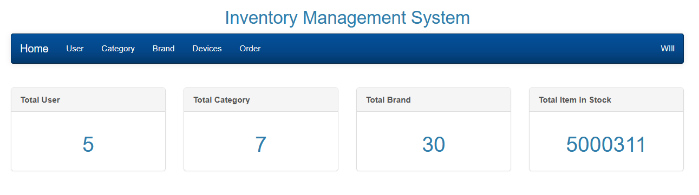
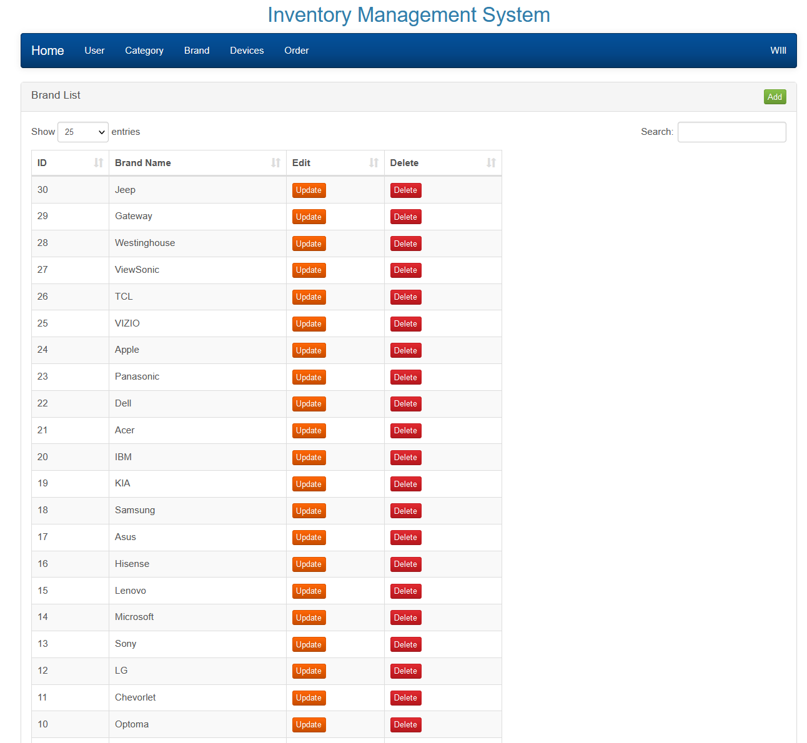

# Cloud-Based Inventory Management Platform

## Overview
This project is a comprehensive inventory management platform designed to facilitate efficient inventory tracking, alerts, and sales forecasting. The platform is built using PHP for back-end development and Bootstrap for the front-end design. It is hosted on AWS EC2 and is designed to offer a seamless user experience with real-time tracking capabilities.
 <!-- You can replace this with an actual screenshot of your platform -->

 <!-- You can replace this with an actual screenshot of your platform -->

## Features

- **Real-Time Tracking**: The platform provides real-time tracking of inventory items, allowing users to have up-to-date information on stock levels and item locations.
- **Inventory Alerts**: Users receive alerts when inventory levels are low, ensuring timely restocking and avoiding stockouts.
- **Sales Forecasting**: The platform analyzes historical sales data to provide sales forecasts, aiding in inventory planning and management.
- **Google Authentication**: Integrated Google Authentication ensures secure user access and protects sensitive information.
- **Load Balancing**: Implemented NGINX reverse proxy for load balancing, optimizing performance and reliability of the platform.

## Technologies Used

- **Back-End**: PHP
- **Front-End**: Bootstrap
- **Hosting**: AWS EC2
- **Database**: RDS, MYSQL
- **Authentication**: Google Authentication
- **Load Balancer**: NGINX

## Installation and Setup

1. **Clone the Repository**: Clone this repository to your local machine.
    ```sh
    git clone https://github.com/your_username/your_repo_name.git
    ```
2. **Set Up Database**: 
    - Create a local database.
    - Execute the `file-management.sql` script to set up the necessary tables and relationships.
    ```sh
    mysql -u your_username -p your_database_name < path_to_file-management.sql
    ```
3. **Configure Environment Variables**: Set up necessary environment variables (e.g., API keys, database credentials).
4. **Run the Application**: 
    - To run the application locally, you can use either Apache or NGINX. Make sure to configure the server to point to the project's root directory.
    - Alternatively, you can deploy the application on an AWS EC2 instance.
    ```sh
    # For Apache
    sudo service apache2 start
    
    # For NGINX
    sudo service nginx start
    ```

## Live Demo

You can access the live demo of the platform [here](https://ec2-3-16-169-142.us-east-2.compute.amazonaws.com/IMSPHP/login.php).

## Contributing

Pull requests are welcome. For major changes, please open an issue first to discuss what you would like to change.

## License

[MIT](https://choosealicense.com/licenses/mit/)
